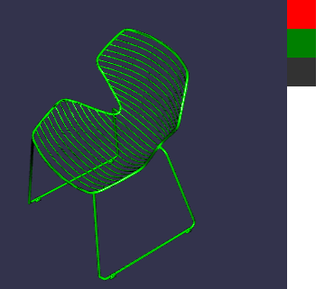

# chair-swatch


Select chair colour. Based on Babylon.js

### To run
```
python -m http.server
```
Then go to
```
http://localhost:8080
```
Alternatively, copy the repo to a directory on a working web server
and access it like so
```
http://<your server url>/<directory>/index.html
```
